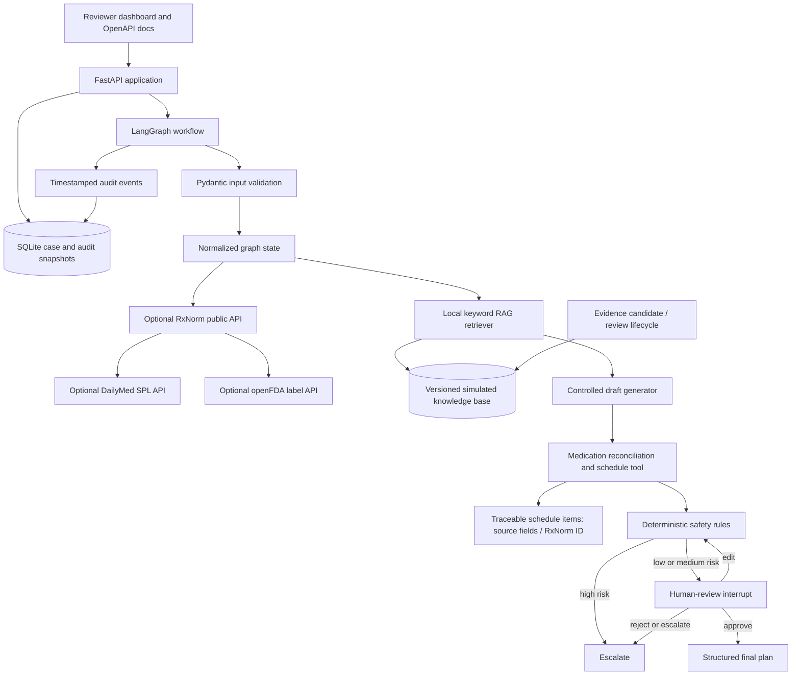
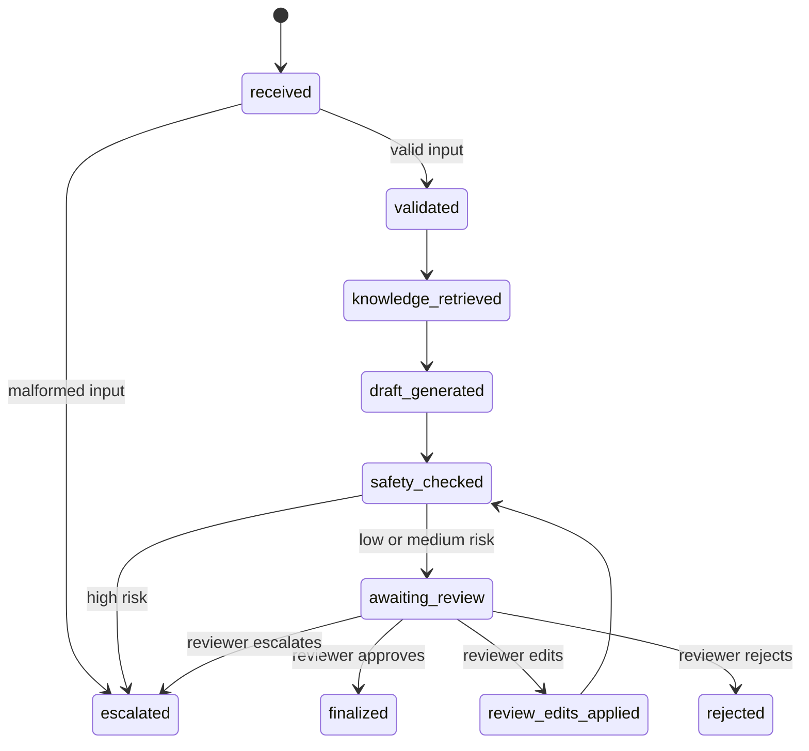

# System Architecture

## Purpose and safety boundary

This is a simulated discharge-planning teaching prototype. It supports a
reviewable draft workflow but does not diagnose, prescribe, alter a medication,
or use real patient data. A reviewer must explicitly approve a draft before a
final plan can be created.

## Component view

## Workflow states

## Implementation decisions

- **RAG:** six versioned local documents are ranked with transparent lexical
- **RAG and curation:** approved local documents are ranked with transparent
  lexical scoring. Candidate evidence is unavailable to RAG until a typed
  clinician/pharmacist review records approval, scope, reason and version;
  retired content is excluded.
- **Reviewer dashboard:** the local UI provides a case list with risk filtering,
  source/evidence/safety cards, controlled editing of education and follow-up
  text, and an audit timeline. Medication schedules are read-only.
- **LLM:** deterministic drafting is the default. An OpenAI structured-output
  adapter is enabled only when both `DISCHARGE_LLM_ENABLED=true` and an API key
  are present. It is limited to care and warning text; medicines and follow-up
  tasks are always derived from validated input.
- **Medication schedule:** the deterministic tool creates a reminder only from
  reconciled source fields. It records the source fields, optional source-order
  reference, and optional RxNorm concept ID; it never calculates a dose or an
  administration time. Missing PRN indication or maximum frequency is high
  risk. A missing route requires reviewer confirmation.
- **External evidence:** with explicit `EXTERNAL_EVIDENCE_ENABLED=true`, the
  workflow sends only a medication name to RxNorm and then a confirmed RxCUI to
  DailyMed; it also queries openFDA by medication name. Cached source URLs,
  response status, timestamps, label versions, and excerpts are reviewer-only
  evidence. Public API failure or ambiguous terminology is a review warning,
  never a guessed match. PubMed runs through a separate curation endpoint and
  cannot feed the runtime RAG corpus automatically.
- **Safety:** medication reconciliation, incomplete medication fields, allergy
  conflicts, duplicate medication conflicts, schedule-field gaps, missing
  evidence, missing follow-up, and workflow-bypass language are checked
  deterministically. Medication reminders cannot be changed through reviewer
  free text; they must be regenerated from the reconciled source.
- **Output grounding:** generated care/warning text is checked for unsupported
  dose, frequency, and medication-action claims. Reviewer-edited follow-up
  tasks must exactly match the clinician-provided source list; otherwise the
  workflow escalates rather than finalizing.
- **Interoperability and governance:** a synthetic-only FHIR R4-shaped Bundle
  export maps medications, allergies, and a CarePlan draft. Reviewer role is a
  typed audit field (`clinician` or `pharmacist`), not production identity or
  access control; see `docs/governance.md`.
- **Review:** a LangGraph interrupt prevents implicit approval. The reviewer
  can approve, edit, reject, or escalate.
- **Persistence:** SQLite stores application-level case snapshots, immutable
  audit events, and the LangGraph checkpoint. A pending review can resume after
  a new application instance is created with the same database path.
